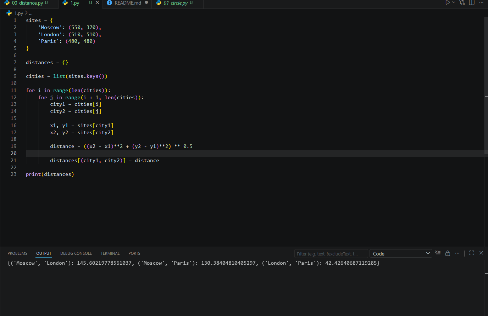

# Отчёт по лабораторной работе №1

## Задание 1 
Вычислить расстояния между городами Moscow, London, Paris по их координатам. Результат сохранить в словарь distances и вывести на экран.

## Описание проделанной работы
Была написана программа на Python, которая:
1. Содержит словарь sites с координатами трёх городов
2. Создаёт пустой словарь distances для результатов
3. Перебирает все уникальные пары городов
4. Вычисляет расстояние между каждой парой по формуле: √((x₂-x₁)² + (y₂-y₁)²)
5. Сохраняет результат в словарь distances
6. Выводит полученный словарь на экран

### Код программы:
```python
sites = {
    'Moscow': (550, 370),
    'London': (510, 510),
    'Paris': (480, 480)
}

distances = {}

cities = list(sites.keys())

for i in range(len(cities)):
    for j in range(i + 1, len(cities)):
        city1 = cities[i]
        city2 = cities[j]
        
        x1, y1 = sites[city1]
        x2, y2 = sites[city2]
        
        distance = ((x2 - x1)**2 + (y2 - y1)**2) ** 0.5
        
        distances[(city1, city2)] = distance

print(distances)

Результат выполнения

{('Moscow', 'London'): 145.60219778561037, ('Moscow', 'Paris'): 130.38404810405297, ('London', 'Paris'): 42.42640687119285}

Шпаргалка по командам git
Команда	Описание
git clone <url>	Клонировать репозиторий с GitHub
git status	Проверить состояние файлов
git add <файл>	Добавить файл для коммита
git add .	Добавить все изменённые файлы
git commit -m "текст"	Сохранить изменения с комментарием
git push	Отправить изменения на GitHub
git pull	Скачать изменения с GitHub

Скриншот


## Ссылки на используемые материалы


- [Документация Python](https://docs.python.org/3/)
- [Формула расстояния между точками](https://ru.wikipedia.org/wiki/Расстояние_между_двумя_точками)
- [Шпаргалка по Git](https://git-scm.com/doc)
<<<<<<< HEAD


# Отчёт по лабораторной работе №2

## Задание
Вычислить площадь круга радиусом 42 и определить, находятся ли точки (23, 34) и (30, 30) внутри этого круга. Центр круга находится в начале координат (0, 0).

## Описание проделанной работы

### 1. Вычисление площади круга
Была использована формула площади круга: S = π × R²
- Значение π = 3.1415926
- Радиус R = 42

Расчёт: площадь = 3.1415926 × 42² = 3.1415926 × 1764 = 5541.7694

### 2. Проверка точки point_1 = (23, 34)
Расстояние от точки до центра круга вычисляется по формуле: √(x² + y²)
- Расстояние = √(23² + 34²) = √(529 + 1156) = √1685 ≈ 41.05
- Сравнение: 41.05 ≤ 42 → True (точка внутри круга)

### 3. Проверка точки point_2 = (30, 30)
- Расстояние = √(30² + 30²) = √(900 + 900) = √1800 ≈ 42.43
- Сравнение: 42.43 ≤ 42 → False (точка вне круга)

## Результаты выполнения программы

| Задача | Результат |
|--------|-----------|
| Площадь круга | 5541.7694 |
| Точка (23, 34) внутри круга? | True |
| Точка (30, 30) внутри круга? | False |

## Скриншот результата



## Ссылки на используемые материалы

- [Документация Python](https://docs.python.org/3/)
- [Формула площади круга](https://ru.wikipedia.org/wiki/Площадь_круга)
- [Расстояние между двумя точками](https://ru.wikipedia.org/wiki/Расстояние)


# Отчёт по лабораторной работе №3

## Задание
Расставить знаки операций "плюс", "минус", "умножение" и скобки между числами "1 2 3 4 5" так, чтобы получилось число "25". Порядок чисел нужно сохранить. Использовать нужно только указанные знаки операций, но не обязательно все перечисленные.

## Описание проделанной работы

### Подход к решению
Было необходимо найти комбинацию арифметических операций и скобок, которая даёт результат 25.

### Найденное решение
Формула: **(1 × 2 + 3) × 4 + 5 = 25**

### Проверка вычислений

| Шаг | Действие | Промежуточный результат |
|-----|----------|------------------------|
| 1 | 1 × 2 | 2 |
| 2 | 2 + 3 | 5 |
| 3 | 5 × 4 | 20 |
| 4 | 20 + 5 | 25 |

### Результат
При подстановке чисел в формулу получается искомое число 25. Задание выполнено успешно.

## Результат выполнения программы

*Где 9 — результат примера (1+2)×3, 25 — результат выполнения задания.*

## Скриншот результата


## Ссылки на используемые материалы

- [Документация Python](https://docs.python.org/3/)
- [Порядок выполнения арифметических операций в Python](https://docs.python.org/3/reference/expressions.html#operator-precedence)


# Отчёт по лабораторной работе №4

## Задание
Имеется строка с перечислением фильмов: `'Терминатор, Пятый элемент, Аватар, Чужие, Назад в будущее'`

Необходимо с помощью индексации строки (срезов) вывести на консоль последовательно:
- первый фильм
- последний фильм
- второй фильм
- второй с конца

## Описание проделанной работы

### Использованные срезы

| Фильм | Срез |
|-------|------|
| Терминатор | `[:10]` |
| Назад в будущее | `[-16:]` |
| Пятый элемент | `[12:26]` |
| Чужие | `[48:54]` |

### Результат выполнения программы


## Скриншот результата


## Ссылки на используемые материалы

- [Документация Python: строки и срезы](https://docs.python.org/3/tutorial/introduction.html#strings)
- [Индексация и срезы строк в Python](https://pythonru.com/osnovy/inteksacija-srezhi-strok-python)


# Отчёт по лабораторной работе №5

## Задание
Создать список членов семьи и список списков с их ростом. Вывести на консоль рост отца и общий рост всех членов семьи.

## Описание проделанной работы

### Созданные списки
- `my_family` — список с именами членов семьи: `['Папа', 'Мама', 'Я']`
- `my_family_height` — список списков, где каждый элемент содержит имя и рост:
  - `['Папа', 180]`
  - `['Мама', 165]`
  - `['Я', 170]`

### Вывод роста отца
Рост отца находится по индексу `[0][1]` (первый элемент списка, второй элемент вложенного списка).

### Вывод общего роста семьи
Общий рост вычисляется сложением роста всех членов семьи: 180 + 165 + 170 = 515 см

## Результат выполнения программы

## Скриншот результата


## Ссылки на используемые материалы

- [Документация Python: списки](https://docs.python.org/3/tutorial/datastructures.html)
- [Списки в Python](https://pythonru.com/osnovy/spiski-python)


# Отчёт по лабораторной работе №6

## Задание
Работа со списком животных в зоопарке. Необходимо:
1. Посадить медведя (bear) между львом и кенгуру
2. Добавить птиц (rooster, ostrich, lark) в конец списка
3. Убрать слона (elephant)
4. Вывести номера клеток, в которых сидят лев и жаворонок

## Описание проделанной работы

### Использованные операции со списками

| Действие | Команда | Результат |
|----------|---------|-----------|
| Вставка медведя | `zoo.insert(1, 'bear')` | Медведь оказался на позиции между львом и кенгуру |
| Добавление птиц | `zoo.extend(birds)` | Птицы добавлены в конец списка |
| Удаление слона | `zoo.remove('elephant')` | Слон удалён из списка |
| Поиск позиции льва | `zoo.index('lion')` | Возвращает индекс (0) |
| Поиск позиции жаворонка | `zoo.index('lark')` | Возвращает индекс (6) |

### Номера клеток
- Клетка льва: индекс 0 + 1 = **1**
- Клетка жаворонка: индекс 6 + 1 = **7**

## Результат выполнения программы

['lion', 'bear', 'kangaroo', 'elephant', 'monkey']
['lion', 'bear', 'kangaroo', 'elephant', 'monkey', 'rooster', 'ostrich', 'lark']
['lion', 'bear', 'kangaroo', 'monkey', 'rooster', 'ostrich', 'lark']


## Скриншот результата


## Ссылки на используемые материалы

- [Документация Python: списки](https://docs.python.org/3/tutorial/datastructures.html)
- [Методы списков insert, extend, remove, index](https://pythonru.com/osnovy/spiski-python)


# Отчёт по лабораторной работе №7

## Задание
Имеется список и словарь с песнями группы Depeche Mode и их длительностью. Необходимо вычислить общее время звучания:
1. Трёх песен из списка: 'Halo', 'Enjoy the Silence', 'Clean'
2. Трёх песен из словаря: 'Sweetest Perfection', 'Policy of Truth', 'Blue Dress'

## Описание проделанной работы

### Работа со списком
В списке `violator_songs_list` каждая песня представлена в виде вложенного списка `[название, время]`. Для получения времени нужной песни используется индекс:

| Песня | Индекс в списке | Время |
|-------|----------------|-------|
| Halo | 3 | 4.9 |
| Enjoy the Silence | 5 | 4.20 |
| Clean | 8 | 5.83 |

**Вычисление:** 4.9 + 4.20 + 5.83 = 14.93 минут

### Работа со словарём
В словаре `violator_songs_dict` время получается по ключу (названию песни):

| Песня | Ключ | Время |
|-------|------|-------|
| Sweetest Perfection | 'Sweetest Perfection' | 4.43 |
| Policy of Truth | 'Policy of Truth' | 4.88 |
| Blue Dress | 'Blue Dress' | 4.18 |

**Вычисление:** 4.43 + 4.88 + 4.18 = 13.49 минут

### Округление результата
Для округления до двух знаков после запятой использована функция `round(число, 2)`

## Результат выполнения программы
Три песни звучат 14.93 минут
А другие три песни звучат 13.49 минут


## Скриншот результата


## Ссылки на используемые материалы

- [Документация Python: списки](https://docs.python.org/3/tutorial/datastructures.html#lists)
- [Документация Python: словари](https://docs.python.org/3/tutorial/datastructures.html#dictionaries)
- [Функция round()](https://docs.python.org/3/library/functions.html#round)


# Отчёт по лабораторной работе №8

## Задание
Расшифровать зашифрованное сообщение, которое состоит из 5 слов. Каждое слово зашифровано в отдельной строке списка `secret_message`. Ключ расшифровки:

| Слово | Правило расшифровки |
|-------|---------------------|
| 1 | 4-я буква |
| 2 | буквы с 10 по 13 включительно |
| 3 | буквы с 6 по 15 включительно, через одну |
| 4 | буквы с 8 по 13 включительно, в обратном порядке |
| 5 | буквы с 17 по 21 включительно, в обратном порядке |

## Описание проделанной работы

### Преобразование номеров букв в индексы
В программировании индексация начинается с 0, поэтому номер буквы на 1 больше индекса:
- 4-я буква → индекс 3
- 10-я буква → индекс 9
- 13-я буква → индекс 12 (срез не включает последний индекс, поэтому указываем 13)
- 6-я буква → индекс 5
- 15-я буква → индекс 14 (указываем 15)
- 8-я буква → индекс 7
- 17-я буква → индекс 16
- 21-я буква → индекс 20 (указываем 21)

### Использованные срезы

| Слово | Срез | Пояснение |
|-------|------|-----------|
| 1 | `[3]` | 4-я буква |
| 2 | `[9:13]` | буквы с 10 по 13 |
| 3 | `[5:15:2]` | буквы с 6 по 15, шаг 2 (через одну) |
| 4 | `[7:13][::-1]` | буквы с 8 по 13, затем переворот |
| 5 | `[16:21][::-1]` | буквы с 17 по 21, затем переворот |

### Результат расшифровки

| Слово | Полученное значение |
|-------|---------------------|
| 1 | п |
| 2 | риме |
| 3 | ркдв |
| 4 | абайт |
| 5 | слать |

**Итоговая фраза:** `пример как два байта переслать`

## Результат выполнения программы


## Скриншот результата


## Ссылки на используемые материалы

- [Документация Python: срезы строк](https://docs.python.org/3/tutorial/introduction.html#strings)
- [Обратные срезы в Python](https://pythonru.com/osnovy/inteksacija-srezhi-strok-python)


# Отчёт по лабораторной работе №9

## Задание
Имеются два кортежа с цветами: один собран в саду, другой — на лугу. Необходимо:
1. Создать множества цветов для сада и луга
2. Вывести все виды цветов
3. Вывести цветы, которые растут и в саду, и на лугу
4. Вывести цветы, которые растут только в саду
5. Вывести цветы, которые растут только на лугу

## Описание проделанной работы

### Исходные данные
- **Сад:** ромашка, роза, одуванчик, ромашка, гладиолус, подсолнух, роза
- **Луг:** клевер, одуванчик, ромашка, клевер, мак, одуванчик, ромашка

### Преобразование в множества
Кортежи содержат повторяющиеся элементы. При преобразовании в множество с помощью функции `set()` все дубликаты удаляются, остаются только уникальные цветы.

### Операции над множествами

| Операция | Знак | Что делает |
|----------|------|-----------|
| Объединение | `\|` | Все цветы из сада и с луга |
| Пересечение | `&` | Цветы, которые есть и в саду, и на лугу |
| Разность | `-` | Цветы, которые есть в первом множестве, но отсутствуют во втором |

### Результаты

| Множество | Цветы |
|-----------|-------|
| Все цветы | ромашка, одуванчик, подсолнух, гладиолус, клевер, роза, мак |
| Общие цветы | ромашка, одуванчик |
| Только в саду | роза, подсолнух, гладиолус |
| Только на лугу | клевер, мак |

## СКРИНШОТЫ

## Ссылки на используемые материалы

- [Документация Python: множества](https://docs.python.org/3/tutorial/datastructures.html#sets)
- [Операции над множествами в Python](https://pythonru.com/osnovy/mnozhestva-set-python)


# Отчёт по лабораторной работе №10

## Задание
Имеется словарь `shops` с тремя магазинами («ашан», «пятерочка», «магнит»), в каждом из которых представлены товары (печенье, конфеты, карамель, пирожное) с ценами.

Необходимо создать словарь `sweets`, в котором для каждого продукта указать два магазина с наименьшими ценами.

## Описание проделанной работы

### Анализ исходных данных

| Продукт | Цены по магазинам |
|---------|-------------------|
| печенье | ашан: 10.99, пятерочка: 9.99, магнит: 11.99 |
| конфеты | ашан: 34.99, пятерочка: 32.99, магнит: 30.99 |
| карамель | ашан: 45.99, пятерочка: 46.99, магнит: 41.99 |
| пирожное | ашан: 67.99, пятерочка: 59.99, магнит: 62.99 |

### Выбор минимальных цен

Для каждого продукта были отобраны два магазина с самыми низкими ценами:

| Продукт | 1-е место (цена) | 2-е место (цена) |
|---------|------------------|------------------|
| печенье | пятерочка (9.99) | ашан (10.99) |
| конфеты | магнит (30.99) | пятерочка (32.99) |
| карамель | магнит (41.99) | ашан (45.99) |
| пирожное | пятерочка (59.99) | магнит (62.99) |

### Структура результирующего словаря

- **печенье:** пятерочка (9.99), ашан (10.99)
- **конфеты:** магнит (30.99), пятерочка (32.99)
- **карамель:** магнит (41.99), ашан (45.99)
- **пирожное:** пятерочка (59.99), магнит (62.99)

## Ссылки на используемые материалы

- [Документация Python: словари](https://docs.python.org/3/tutorial/datastructures.html#dictionaries)
- [Список словарей в Python](https://pythonru.com/osnovy/spisok-slovarej-python)


# Отчёт по лабораторной работе №11

## Задание
Имеется словарь `goods` с кодами товаров (Лампа, Стол, Диван, Стул) и словарь `store`, где по кодам товаров хранятся списки партий с количеством и ценой.

Необходимо рассчитать общее количество и общую стоимость каждого товара на складе и вывести результат в формате: `<товар> - <кол-во> шт, стоимость <общая стоимость> руб`

## Описание проделанной работы

### Исходные данные по товарам

| Товар | Код | Партии (количество × цена) |
|-------|-----|---------------------------|
| Лампа | 12345 | 1 партия: 27 шт × 42 руб |
| Стол | 23456 | 2 партии: 22 шт × 510 руб, 32 шт × 520 руб |
| Диван | 34567 | 2 партии: 2 шт × 1200 руб, 1 шт × 1150 руб |
| Стул | 45678 | 3 партии: 50 шт × 100 руб, 12 шт × 95 руб, 43 шт × 97 руб |

### Расчёты

| Товар | Общее количество | Общая стоимость |
|-------|------------------|-----------------|
| Лампа | 27 шт | 27 × 42 = 1134 руб |
| Стол | 22 + 32 = 54 шт | (22×510) + (32×520) = 11220 + 16640 = 27860 руб |
| Диван | 2 + 1 = 3 шт | (2×1200) + (1×1150) = 2400 + 1150 = 3550 руб |
| Стул | 50 + 12 + 43 = 105 шт | (50×100) + (12×95) + (43×97) = 5000 + 1140 + 4171 = 10311 руб |

### Результат

| Товар | Количество | Стоимость |
|-------|-----------|-----------|
| Лампа | 27 шт | 1134 руб |
| Стол | 54 шт | 27860 руб |
| Диван | 3 шт | 3550 руб |
| Стул | 105 шт | 10311 руб |

## Ссылки на используемые материалы

- [Документация Python: словари](https://docs.python.org/3/tutorial/datastructures.html#dictionaries)
- [Список словарей в Python](https://pythonru.com/osnovy/spisok-slovarej-python)
=======
>>>>>>> bc69d024f689d7d98ba3d7292e7d478804987ee8
