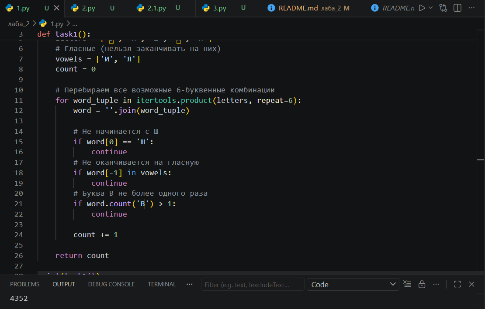

Задание 1 

### Условие задачи: 

 Вася составляет 6-буквенные слова, в которых могут быть использованы только буквы В, И, Ш, Н, Я, причём буква В используется не более одного раза. Каждая из других допустимых букв может встречаться в слове любое количество раз или не встречаться совсем. Слово не должно начинаться с буквы Ш и оканчиваться гласными буквами. Словом считается любая допустимая последовательность букв, не обязательно осмысленная. Сколько существует таких слов, которые может написать Вася

### Описание проделанной работы

Для решения задачи был использован язык программирования **Python** и библиотека **itertools**, а именно функция `product()`, которая позволяет перебрать все возможные комбинации букв длиной 6.

1. Создаём список всех доступных букв: `['В', 'И', 'Ш', 'Н', 'Я']`
2. Определяем список гласных букв: `['И', 'Я']`
3. Счётчик слов устанавливаем в 0
4. С помощью `itertools.product` перебираем все возможные 6-буквенные комбинации
5. Для каждой комбинации проверяем условия:
   - Слово не начинается с буквы `Ш`
   - Слово не заканчивается на гласную (`И` или `Я`)
   - Буква `В` встречается не более одного раза
6. Если все условия выполнены, увеличиваем счётчик на 1
7. Выводим полученное количество

Скриншоты результатов

Ссылки на используемые материалы

https://habr.com/ru/companies/otus/articles/529356/
https://docs.python.org/3/library/itertools.htmlhttps://proglib.io/p/iteriruemsya-pravilno-20-priemov-ispolzovaniya-v-python-modulya-itertools-2020-01-03