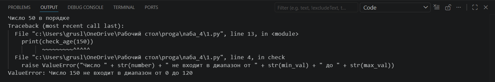
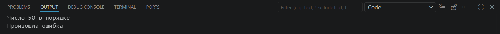

## Условие задачи: 

-Замыкание, определяющее нахождение аргуметов в допустимых диапазонах.
Декоратор, который будет оборачивать каждую функцию в try блок для обработки ошибок.

Решите обе задачи своего варианта.

Примените декоратор к замыканию.

## Описание проделанной работы 

Реализация замыкания: Была написана функция range_checker, которая принимает границы диапазона и возвращает вложенную функцию check. Замыкание успешно захватывает переменные min_val и max_val, позволяя проверять любое число на соответствие границам.

Реализация декоратора: Был создан декоратор error_handler. Он использует блок try...except, чтобы перехватывать исключения в процессе выполнения целевой функции, предотвращая аварийное завершение программы (crash) и возвращая вместо этого сообщение об ошибке.

Объединение логики: На финальном этапе декоратор был применен к экземпляру замыкания. Это позволило создать «защищенную» версию функции проверки (safe_check), которая корректно обрабатывает как валидные числа, так и значения, выходящие за границы диапазона (выбрасывающие ValueError).

## Скриншоты результатов

## Ссылки на используемые материалы

https://www.google.com/search?q=https://docs.python.org/3/reference/executionmodel.html%23naming-and-binding

https://wiki.python.org/moin/PythonDecorators
