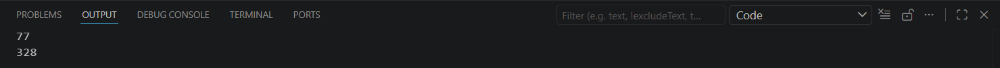

## Условие задачи: 

Генератор простых чисел. Просуммируйте возвращаемые числа.

## Описание проделанной работы

Часть 1: Замыкание и Декоратор
В ходе работы был разработан инструмент для безопасной валидации числовых данных:

Замыкание (range_checker): Функция запоминает границы min_val и max_val и возвращает вложенную функцию, которая проверяет число на вхождение в этот диапазон.

Декоратор (error_handler): Обертка, которая перехватывает ValueError (и любые другие исключения) внутри функции, предотвращая аварийное завершение программы.

Интеграция: Декоратор был применен к экземпляру замыкания. Это позволило создать безопасный интерфейс, возвращающий текстовое сообщение об ошибке вместо вызова Traceback.

Часть 2: Генератор и reduce
Была реализована логика для работы с бесконечными (или ограниченными) потоками данных:

Генератор (prime_generator): Реализован эффективный алгоритм поиска простых чисел с использованием yield, что позволяет экономить память.

Агрегация: Для суммирования чисел из генератора была использована функция reduce из модуля functools.

Оптимизация: Передача генератора в reduce напрямую (без конвертации в list) позволила выполнить вычисления «на лету» без загрузки всего набора чисел в оперативную память.

## Скриншоты результатов

## Ссылки на используемые материалы

https://wiki.python.org/moin/Generators

https://www.google.com/search?q=https://docs.python.org/3/library/functools.html%23functools.reduce