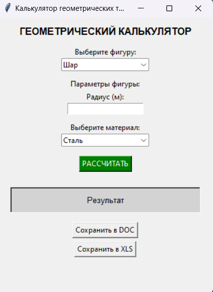

## Условие задачи: 

 создайте пакет, содержащий 3 модуля, и подключите его к основной программе.
Основная программа должна предоставлять:
графический пользовательский интерфейс с возможностями ввода требуемых параметров и отображения результатов расчёта,
возможность сохранить результаты в отчёт формата .doc или .xls (например, пакеты python-docx и openpyxl).

Геометрические тела

Параллелепипед
Тетраэдр
Шар
Расчёт объема, площади поверхности, массы в зависимости от материала

В рамках проекта были поставлены следующие задачи:
- **Геометрические расчеты:** Создать библиотеку для вычисления объема и площади поверхности различных тел (шар, тетраэдр, параллелепипед).
- **Физические расчеты:** Реализовать функцию вычисления массы тела на основе его объема и плотности материала.
- **Экспорт данных:** Реализовать возможность сохранения результатов расчетов в файлы формата Microsoft Word (.docx) и Excel (.xlsx).
- **Графический интерфейс:** Создать GUI-приложение (используя `tkinter`), обеспечивающее удобный ввод данных и отображение результатов.
- **Архитектура:** Разработать модульную структуру проекта для разделения логики, вычислений и интерфейса.

## Описание проделанной работы

- `main.py` — основной файл запуска приложения. Отвечает за работу графического интерфейса и связывает все модули воедино.
- `geometry_lib/solids.py` — модуль с логикой геометрических фигур.
- `geometry_lib/physics.py` — модуль для расчетов физических параметров (массы).
- `geometry_lib/exporter.py` — модуль, отвечающий за создание файлов и сохранение данных.
- `__pycache__/` — автоматически создаваемая директория с байт-кодом Python для оптимизации запуска.

**Ключевые особенности реализации:**
- Использование пакетов (`geometry_lib`) для логической группировки функций.
- Реализация `lambda`-функций для обработки событий кнопок.
- Обработка исключений (try-except) для предотвращения сбоев при работе с файловой системой.
- Применение `tkinter.Entry` и `tkinter.Label` для создания простого и функционального пользовательского интерфейса.

## Скриншоты результатов

## Ссылки на используемые материалы

https://docs.python.org/3/library/tkinter.html

https://python-docx.readthedocs.io/

https://openpyxl.readthedocs.io/